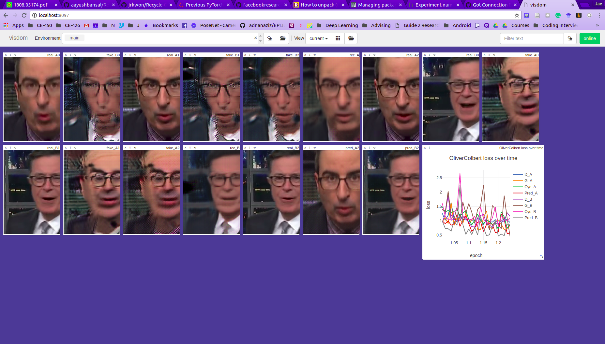

# Recycle-GAN :Unsupervised Video Retargeting 

Here, I would like to test Recycle-GAN especially with faces. Anaconda is being used to maintain an environment for python packages.

## Prepare he Environment

I assume CUDA and Anaconda are already installed.

### Clone this repo
```
$ git clone https://github.com/jrkwon/Recycle-GAN
```
### Create a Conda Environment
```
$ conda create recycle-gan
```

### Activate the Conda Environment
```
$ source activate recycle-gan
```
After activating the `recycle-gan` environment, the prompt will have `(recycle-gan)`.

### Install Required Packages

- python 3.5+
- pytorch 0.4.1
- torchvision 0.2.1
- pillow 5.4.1
- cython 0.28.5
- visdom 0.1.8.8
- dominate 2.3.5

```
(recycle-gan) $ conda install pytorch=0.4.1 torchvision=0.2.1 pillow=5.4.1 cython=0.28.5 visom=0.1.8.8 dominate=2.3.4
```

### Prepare for Datasets

- Download face datasets from [here](https://www.dropbox.com/s/s6kzovbrevin5tr/faces.tar.gz?dl=0)
- Create  the `datasets` folder.
```
(recycle-gan) $ mkdir datasets
```
- Untar the `faces.tar.gz`
```
(recycle-gan) $ tar -xzf ~/Download/faces.tar.gz ./datasets/
```

## Training

### Visdom Visualization Server

Open a terminal and start visdom visualization server.

```
(recycle-gan) $ python -m visdom.server
```

### Start Training
Open another terminal and start a training with a dataset name.

Use the script in the `scripts` folder to train.
 
```
(recycle-gan) $ sh ./scripts/train_recycle_gan.sh DataSetName
```
The `DataSetName` is a folder name that has `trainA` and `trainB` folders (the default setting for the dataset folder configuration is _unaligned_ which means that there are two separate folders for the source and target).

### Visdom

Open a web browser and go to `localhost:8097`. Then you will see something like below.



## More Details about the Code Structure and Training/Test

You can find them from [CycleGAN and pix2pix](https://github.com/junyanz/pytorch-CycleGAN-and-pix2pix).

- [Code Structure](https://github.com/junyanz/pytorch-CycleGAN-and-pix2pix/blob/master/docs/overview.md)
- [Training/Test Tips](https://github.com/junyanz/pytorch-CycleGAN-and-pix2pix/blob/master/docs/tips.md)
- [Datasets Folder Structure](https://github.com/junyanz/pytorch-CycleGAN-and-pix2pix/blob/master/docs/datasets.md)

## How to Test a Trained Model

You may stop the training if the losses are not decreasing any more.

```
(recycle-gan) $ sh scripts/test_recycle_gan.sh DataSetName
```
The `DataSetName` was used to create a trained PyTorch model file when the training starts. The default path to the models is `./checkpoints/DataSetName`. Thus this script for testing looks up the folder where the model files are saved and use the latest one by default.

The default setting of the number of images to process is 100. You may change the number inside `test_recyle_gan.sh`. 

The test process will create an output folder whose name is `./results/DataSetName/test_latest/images/`. You can take a look at the real-fake image pairs from each epoch through `index.html` in the folder by using a Web browser.

The `images` folder has generated images. Their names are as belows.

```
ImageName_real_A.png
ImageName_fake_B.png
imageName_real_B.png
ImageName_fake_A.png
....
```

`ImageName_real_A` was an input to generate `ImageName_fake_B`. And `ImageName_real_B` was used to create `ImageName_fake_A`.

Thus, if you want to see the performance of the GAN from A to B (use A as a source and B as a target), you can create two videos and a side-by-side video using ffmpeg as follows. I assume the test image names are five digits with zero padding (e.g. 00000.png, 00001.png, .... in the sequential order).


I added two scripts to make a process to create videos easier. `ffmpeg` was used inside the script to create the videos.

The script below will create two videos (real_A.mp4 and fake_B.mp4) and one side-by-side video (real_A_fake_B.mp4)
```
(recycle-gan) $ sh ./scripts/create_video_real_A_fake_B.sh DataSetName
```

If you want to make a video from B to A, use this script below.
```
(recycle-gan) $ sh ./scripts/create_video_real_B_fake_A.sh DataSetName
```

Here are videos that I created. I used a training model from epoch 13 to create the images.

### Real A (Obama) to Fake B (Trump)

Here, the left Obama is a real and the right Trump is generated fake based on the Obama videos. 

[](https://youtu.be/61doJbwKoAE)

### Real B (Trump) to Fake A (Obama)

The left Trump is a real and the right Obama is generated fake based on the Trump videos.

[](https://youtu.be/TOcK7sHphng)

  
---

---

## Followings are from the original repository

---
# Recycle-GAN :Unsupervised Video Retargeting 


This repository provides the code for our work on [unsupervised video retargeting](http://www.cs.cmu.edu/~aayushb/Recycle-GAN/). 

```make
@inproceedings{Recycle-GAN,
  author    = {Aayush Bansal and
               Shugao Ma and
               Deva Ramanan and
               Yaser Sheikh},
  title     = {Recycle-GAN: Unsupervised Video Retargeting},
  booktitle   = {ECCV},
  year      = {2018},
}
```

Acknowledgements: This code borrows heavily from the PyTorch implementation of [Cycle-GAN and Pix2Pix](https://github.com/junyanz/pytorch-CycleGAN-and-pix2pix). A  huge thanks to them!


### John Oliver to Stephen Colbert
[](https://www.youtube.com/watch?v=VWXFqDdqLbE)

Click above to see video!


### Video by CMU Media folks
[](https://youtu.be/ehD3C60i6lw)

Click above to see video!

## Introduction

We use this formulation in our ECCV'18 paper on unsupervised video retargeting for various domains where space and time information matters such as face retargeting. Without any manual annotation, our approach could learn retargeting from one domain to another.

## Using the Code

The repository contains the code for training a network for retargeting from one domain to another, and use a trained module for this task. Following are the things to consider with this code:

### Data pre-processing

For each task, create a new folder in "dataset/" directory. The images from two domains are placed respectively in "trainA/" and "trainB/". Each image file consists of horizontally concatenated images, "{t, t+1, t+2}" frames from the video. The test images are placed in "testA/" and "testB/". Since we do not use temporal information at test time, the test data consists of single image "{t}".

## Training

There are two training modules in "scripts/" directory: (1). Recycle-GAN, (2). ReCycle-GAN

### Recycle-GAN

We used this module for examples in the paper, specifically face to face, flower to flower, clouds and wind synthesis, sunrise and sunset.

### ReCycle-GAN

We found this module useful for tasks such as unpaired image to labels, and labels to image on VIPER dataset, image to normals, and normals to image on NYU-v2 depth dataset.

## Prediction Model

There are two prediction model used in this work: (1). simple U-Net, (2). higher-capacity prediction.

### unet-128, unet-256

If you want to use this prediction module, please set the flag "--which_model_netP" to "unet_128" and "unet_256" respectively.

### prediction

An advanced version of prediction module is a higher capacity module by setting the flag "--which_model_netP" to "prediction".


## Observation about training: 

We observed that model converges in 20-40 epochs when sufficiently large data is used. For smaller datasets (ones having 1000 images or less), it is suitable to let it train for longer.

## Test

At test time, we do inference per image (as mentioned previously). The test code is based on cycle-gan.


## Data & Trained Models:

Please use following links to download Face, Flowers, and Viper data: 

1. [Faces (10 GB)](https://www.dropbox.com/s/s6kzovbrevin5tr/faces.tar.gz?dl=0) 
2. [Flowers (1.6 GB)](https://www.dropbox.com/s/f8nnulkcsovxwmf/flowers.tar.gz?dl=0)
3. [Viper (3.17 GB)](https://www.dropbox.com/s/qhu29y5cx4lyfun/Viper_data.tar.gz?dl=0)


Please contact [Aayush Bansal](http://cs.cmu.edu/~aayushb) for any specific data or trained models, or for any other information. 
